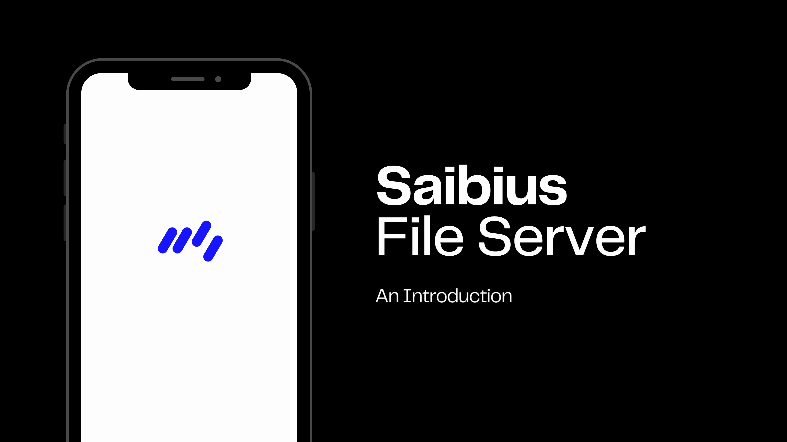
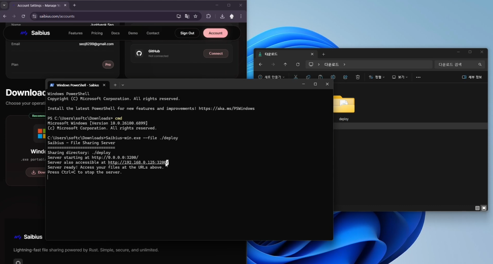
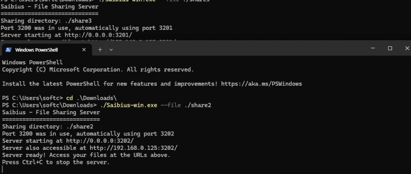
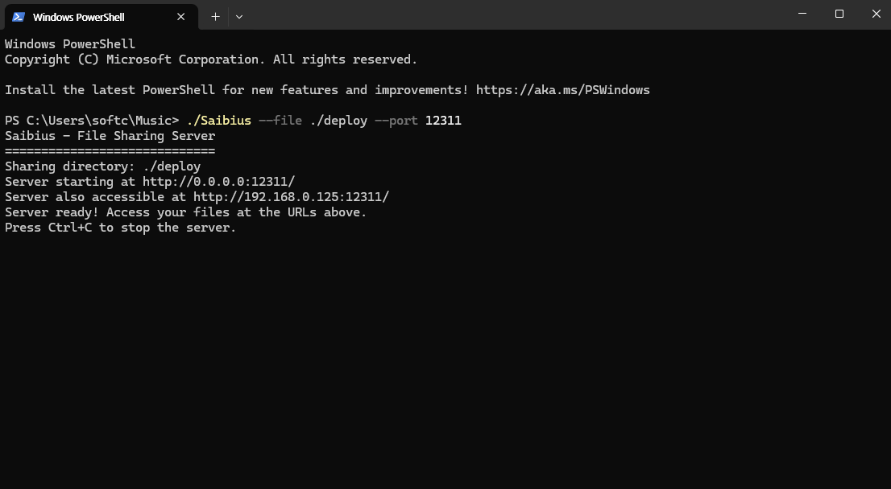
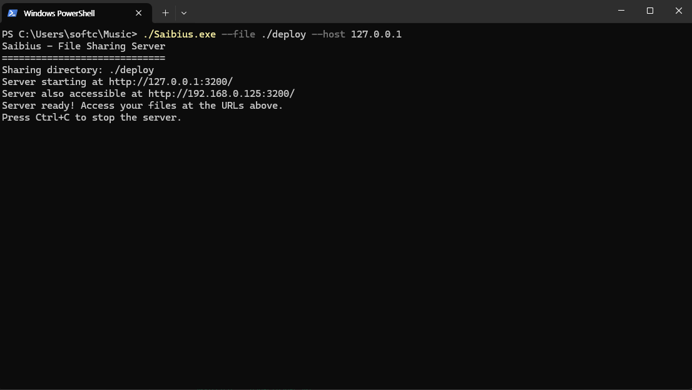
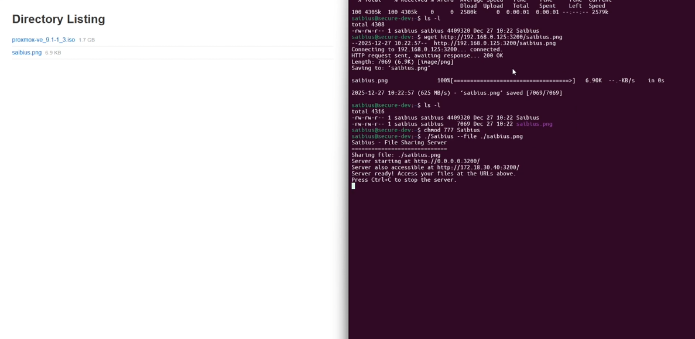

# Saibius

**Instant File Sharing for Server Management**

Below is an overview of Saibius use cases. For more detailed information, please refer to the full report.  



### Use Case 1 : Instant file sharing (No Setup, Just Share)
---
Share files with nearby devices instantly, no strings attached.   
Saibius requires zero installation or setup—just run the app and start sharing right away.  



A single command is enough:  
```bash
./saibius --file ./share
```

One command is all you need to expose your files or directories over HTTP instantly.   
Anyone on your network can access them via a simple link. No setup, no global installation, and no background services required.  

### Use Case 2 : Automatic Port Resolution (No more Port select for share)
---
Saibius automatically detects port conflicts and selects an available port
without requiring user intervention.  



Port 3200 was in use, automatically using port 3201  

This allows multiple instances of Saibius to run in parallel on the same system,
making it ideal for CI pipelines, local testing, and internal distribution.

### Use Case 3 : Explicit Port Binding
---
For environments that require fixed network configurations,
Saibius allows explicit port binding via the `--port` option.  



```bash
./saibius --file ./share --port 12312
```

### Use Case 4 : Localhost-Only Access
---
In scenarios where external network access must be strictly blocked,
Saibius can be bound to the local loopback interface only.

By explicitly setting the host to `127.0.0.1`, the shared files become accessible
exclusively from the local machine.  

```bash
./saibius --file ./share --host 127.0.0.1
```

This prevents external port exposure and ensures that file access is limited
to local processes and users.



This approach is ideal for local testing, CI pipelines, and security-sensitive
environments where network isolation is required.  

### Use case 5 : Working with WSL  
---
Saibius enables seamless file sharing between the host system and WSL
without requiring shared folders or additional configuration.

Files hosted on the Windows environment can be directly accessed
from WSL using standard tools such as `wget` or `curl`.  



Once downloaded, Saibius can be executed immediately inside WSL,
allowing the same workflow to continue natively in the Linux environment.

This approach is ideal for cross-platform development, testing,
and environments where Windows and Linux workflows coexist.  

### Author Message
---

Hello, I'm JunHyeok Seo, CEO of Artsnoa and developer of Saibius.

While building server infrastructure at school and in the lab, I experienced daily frustrations. The repetitive tasks of transferring files between servers and sending files from desktops were incredibly inefficient.

Saibius was born to solve these repetitive frustrations.

Saibius strives to support a wide range of platform versions and has been tested on Ubuntu 24 and later. It has also been verified on Debian (ARM) running on a Raspberry Pi 3 B+.

Work to expand support for additional versions is ongoing. If you experience any issues, please feel free to open an issue. Resolution may take some time, and we appreciate your understanding.  

P.S. Polished with AI for better readability.

Messaged by Artsnoa, JunHyeok Seo(Mirseo)

Saibius does not require global installation. 
Download it when needed, use it, and remove it afterward.

You can always fetch the latest binary from the website. 

